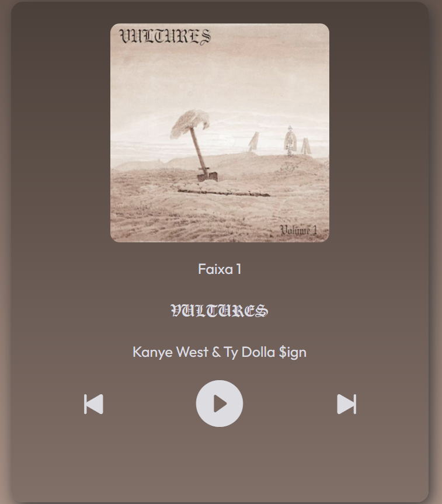

# # Player de música 🎵

> Projeto desenvolvido a partir de um intensivão de JavaScript no qual participei

### 💻 Tecnologias utilizadas

- [x] HTML -> para estruturar o projeto
- [x] CSS -> para estilizar e dar vida na estrutura do projeto
- [x] JavaScript -> para dar inteligência aos elementos do projeto

###  Visualize o projeto

- <a href="https://65ba970465b4cc0675000e4f--clever-pegasus-adf115.netlify.app/" target="_blank">Clique aqui!<a/>

